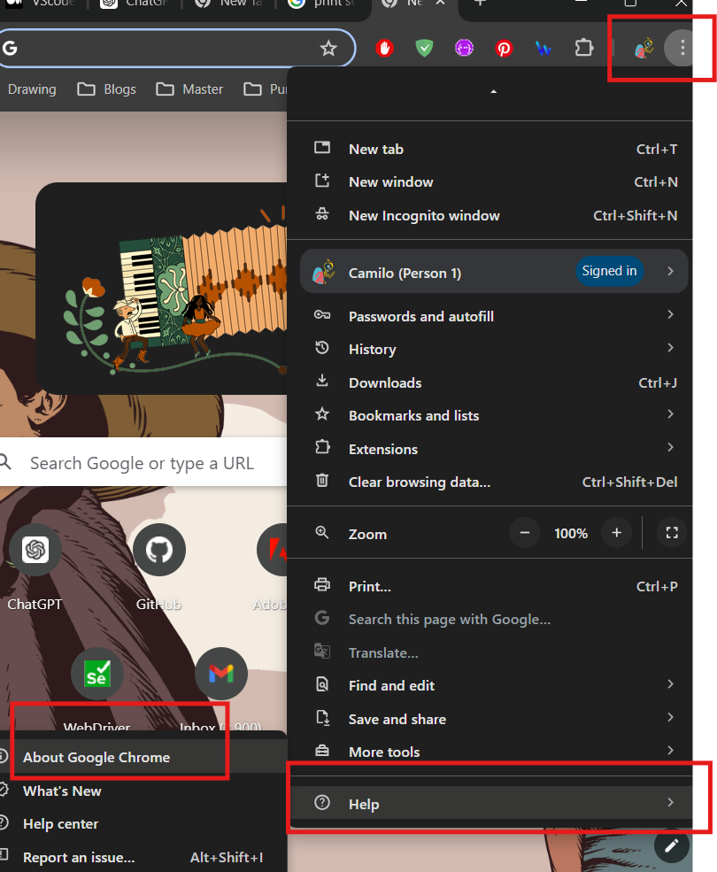
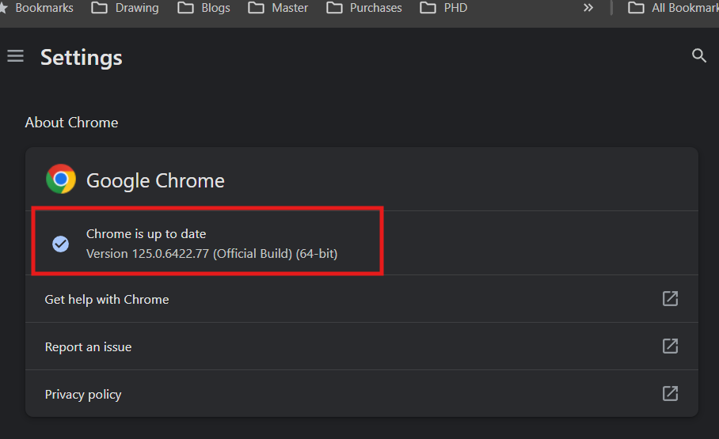
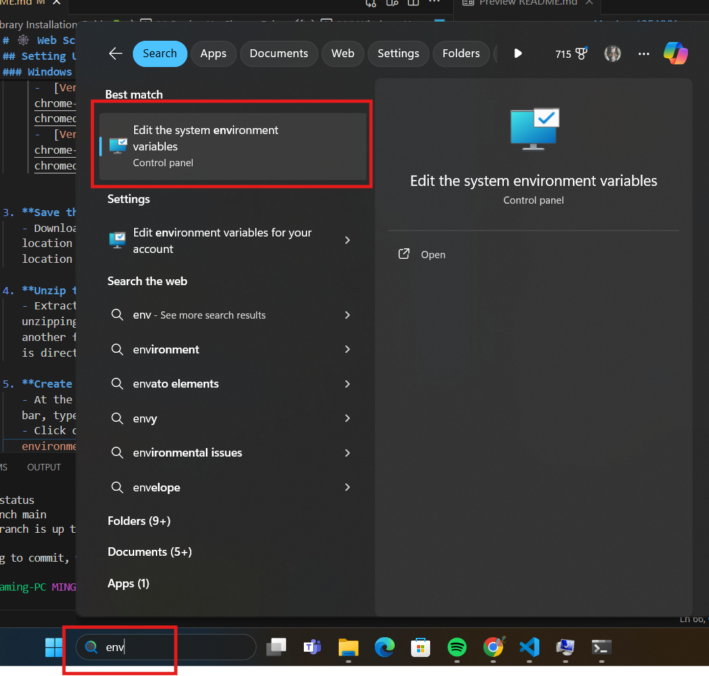
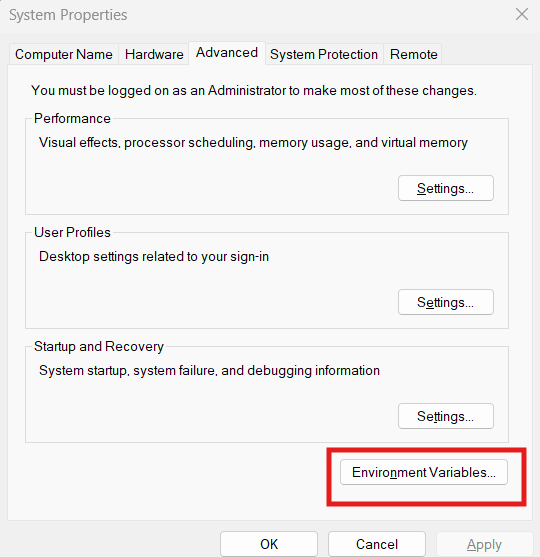
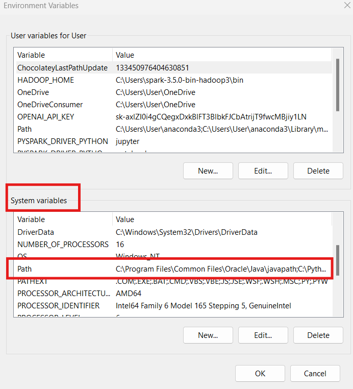
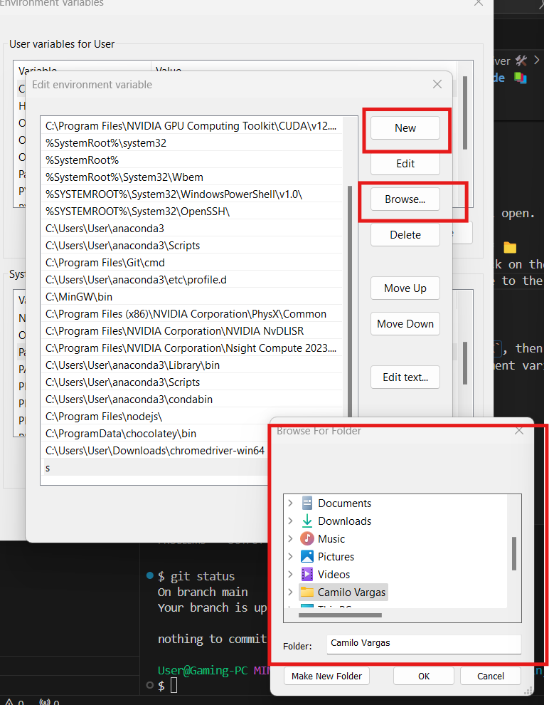

# Data Scraping 🤖

# 🕸️ Web Scraping Library Installation Guide 📚

## Introduction 🌟

Web scraping is a powerful tool in the arsenal of data analysts and data scientists. It allows you to gather data from websites, which can be invaluable for various analyses and insights. By automating the process of data collection, you can save time and ensure that you have up-to-date information. Let's get started on setting up the necessary libraries for web scraping! 🚀

## Steps to Install the Libraries 🛠️

### 1. Open Your Terminal 💻

First, open the terminal you usually use. This could be Git Bash, Anaconda Prompt, or any other terminal of your choice.

### 2. Activate Your Environment 🌱

Activate the environment in which you usually work. For example, if you are using Anaconda, you can activate your environment with the following command:

```bash
conda activate myenv
```
Replace myenv with the name of your environment.

### 3. Install the Required Libraries 📦
Now, let's install the libraries needed for web scraping. Run the following commands in your terminal one after another one:
```bash
pip install splinter
````
```bash
pip install html5lib
```
```bash
pip install lxml
```
```bash
pip install selenium
```
These libraries will provide you with the tools to interact with web pages, parse HTML content, and automate browsing tasks.

## Setting Up ChromeDriver 🛠️

### Why Do We Need ChromeDriver? 🤔

ChromeDriver is a separate executable that Selenium uses to control Chrome. It is necessary for automating tasks in the Chrome browser, such as navigating through web pages, clicking buttons, and filling out forms. Without ChromeDriver, Selenium cannot interact with Chrome.

### Mac Users 🍏

For Mac users, installing ChromeDriver is straightforward. Simply run the following command in your terminal:
```bash
brew install chromedriver
```
🍺 if you don't have **Homebrew** installed, you need to install it first. Homebrew is a package manager for macOS that makes it easy to install and manage software, similar to how pip is used for managing Python packages. Run the following command in your terminal to install Homebrew:
```bash
/bin/bash -c "$(curl -fsSL https://raw.githubusercontent.com/Homebrew/install/HEAD/install.sh)"
```

Then, try again with `brew install chromedrive`

### Windows Users 🖥️

For Windows users, the process is a bit more involved. Follow these steps:

1. **Find the Version of Your Chrome** 🔍
   - Open Chrome and go to `Settings > About Chrome` to find your Chrome version.
   - 
  

   - 

2. **Download the ChromeDriver** 📥
   - Based on the version of your Chrome, you need to download an specific Chrome driver. Here are the options:
     - [Version 123.XXX](https://storage.googleapis.com/chrome-for-testing-public/123.0.6312.122/win64/chromedriver-win64.zip)
     -  [Version 124.XXX](https://storage.googleapis.com/chrome-for-testing-public/124.0.6367.207/win64/chromedriver-win64.zip) 
     -  [Version 125.XXX](https://storage.googleapis.com/chrome-for-testing-public/125.0.6422.76/win64/chromedriver-win64.zip)
  

3. **Save the Downloaded File** 💾
   - Download the `.zip` file and save it in a meaningful location that you will remember, as you will need this location later.

4. **Unzip the File** 📂
   - Extract the contents of the `.zip` file. After unzipping, you will find that there is a folder inside another folder. Move the inner folder to a location that is directly accessible and easy to remember.

5. **Create an Environment Variable** 🌐
   - At the bottom of the Windows taskbar, in the search bar, type `environment variables`.
   - Click on the option that says `Edit the system environment variables`.
  

6. **Edit Environment Variables** ⚙️
   - Click on `Environment Variables`.

    

7. **Find the Path Variable** 🔍
   - Under the section `System variables`, find the variable called `Path` and click it.

    

8. **Edit the Path Variable** ✏️
   - Click on `Edit`, and a new window will open.

9. **Browse for the ChromeDriver Location** 📁
   - Click on `New` on the right side, click on the new row created, and click on `Browse`. Navigate to the location where you saved your ChromeDriver.

    

10. **Save the Path** 💾
    - After finding the location, click `OK`, then `OK` again. Now you have created an environment variable for the ChromeDriver.

## Final Check: Running a Jupyter Notebook 📒

To ensure everything is set up correctly, you can run a Jupyter Notebook that we have included in the repository. This notebook will test the installation and configuration of the libraries and ChromeDriver. If you run it, you will see a Chrome window navigating to http://quotes.toscrape.com/